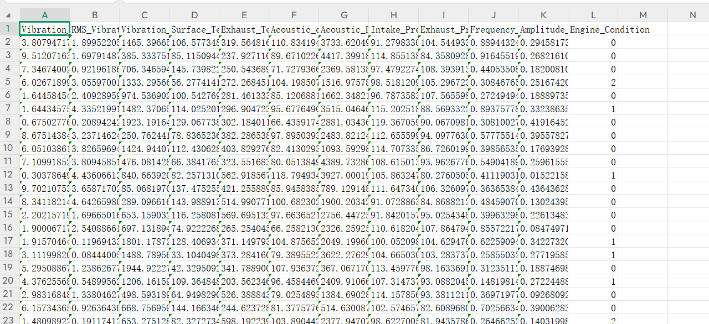

# Electric Engine Failure Data Set CSV Format.zip

The engine fault detection data dataset is in CSV format for use with advanced signal processing and machine learning techniques to detect and classify engine faults.

It includes sensor reading data collected under various operating conditions of the engine, including normal, minor faults, and severe fault states.

Features:

- The dataset includes 11 independent variables (sensor readings and derived features) and 1 dependent variable (engine condition label).

Here are the detailed descriptions of the columns:

Column Name | Description | Unit | Range
---|---|---|---
Vibration amplitude | Peak vibration amplitude measured at the engine | mm/s² | 0.1 - 10.0
RMS vibration | RMS value of the engine vibration | mm/s² | 0.05 - 5.0
Vibration frequency | Frequency of the engine vibration | Hz | 20 - 2000
Surface temperature | Temperature of the engine surface | °C | 30 - 150
Exhaust temperature | Temperature of exhaust gases | °C | 200 - 600
Decibel level | Acoustic noise level generated by the engine | dB | 60 - 120
Acoustic frequency | Frequency of the acoustic signals from the engine | Hz | 100 - 5000
Intake pressure | Pressure in the intake manifold | kPa | 90 - 120
Exhaust pressure | Pressure in the exhaust gases | kPa | 80 - 110
Frequency band energy | Energy in a specific frequency band (from short-time Fourier transform) | Any unit | 0.1 - 1.0
Amplitude mean | Averaging of signal amplitudes in a specific time window | Any unit | 0.01 - 0.5
Engine status | Marker indicating the engine's operational state: -0 (normal), 1 (minor fault), 2 (severe fault)

Data characteristics:

Total sample count: 10,000
Category distribution:
60% Normal (0): Engine running without any faults.
30% Minor faults (1): Engine running with minor issues.
10% Severe faults (2): Engine running under severe fault conditions.
## Images

Here is a pay link on Stripe ( https://buy.stripe.com/3cs8yP7sY87d0vu9AB ). Please contact me lonlonago@foxmail.com after funding $89, and I will send you a complete data files , thank you!

